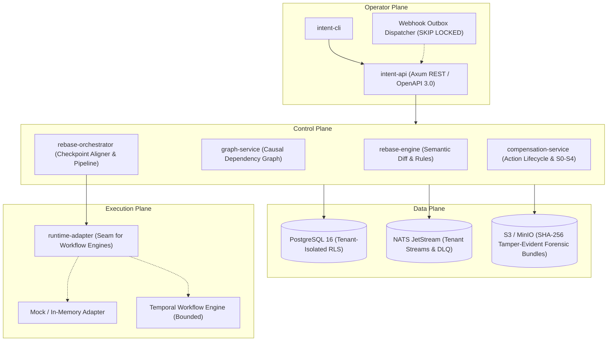
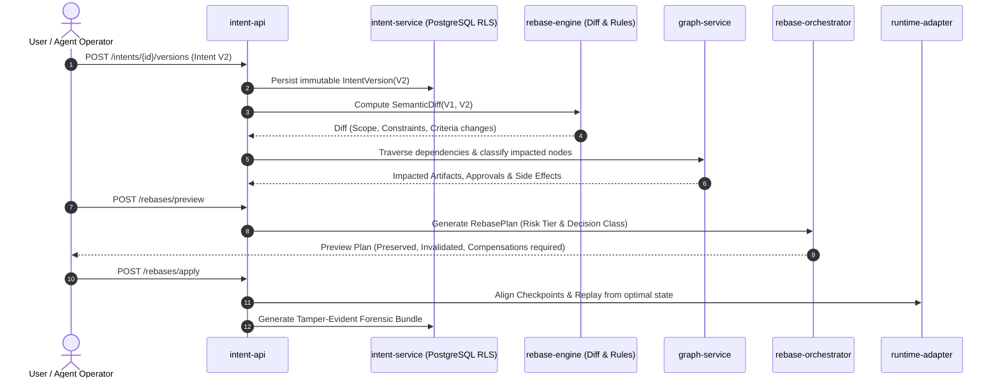

<div align="center">

# ⚡ Intent Rebase Engine (IRE)

**Rebase in-flight agent work when the intent changes — instead of letting it drift on a stale promise.**

[](LICENSE)
[](https://www.rust-lang.org/)
[](Cargo.toml)
[](crates/)
[](docs/11-quality/01-test-strategy.md)
[](docs/02-architecture/03-trust-boundaries.md)
[](docs/README.md)
[](#safety-boundaries--production-status)

[English](README.md) · [Tiếng Việt](README.vi.md)

[The Problem](#the-problem-agentic-drift) •
[Architecture](#architecture--core-lifecycle) •
[Decision Engine](#core-decision-matrix) •
[Quickstart](#quickstart) •
[API & CLI](#api--cli-showcase) •
[Crates Catalog](#workspace-crates-11) •
[Quality Gates](#verification--quality-gates)

---

</div>

## The Problem: Agentic Drift

In multi-step, autonomous AI workflows (coding copilots, customer service automations, research workflows, and policy-driven agents), **human intent is dynamic and volatile**. Users revise requirements, narrow security constraints, retract sensitive permissions, or tighten budgets mid-execution.

Current agent architectures handle mid-flight intent changes in one of two catastrophic ways:
1. **Ignoring the change (Agentic Drift):** The agent keeps executing under the old intent, burning expensive LLM tokens, generating pull requests with deprecated requirements, or dispatching irreversible external side effects under an invalidated promise.
2. **Hard resetting from zero (Wasted Progress):** The system terminates everything and restarts from scratch, throwing away completed validations, expensive tool calls, and human approvals that were unaffected by the change.

```
Without IRE:
User updates Spec ───► Agent continues on stale prompt ───► Hallucinated / Deprecated Work ❌
                     └── Or: Hard abort & Restart ────────► Wasted Tokens & Lost Progress ❌

With IRE:
User updates Spec ───► IRE Computes Semantic Diff ───────► Causal Impact Graph Traversal
                                                           ├── Preserves valid work (Checkpoints)
                                                           ├── Invalidates stale approvals
                                                           ├── Schedules compensations (S1-S4)
                                                           └── Emits Rebased Execution Plan ⚡
```

**Intent Rebase Engine (IRE)** provides a dedicated, audit-first **control plane** for intent changes. It versions user intent, computes a semantic diff between intent states, models causal impact across downstream tasks via a dependency graph, and **rebases** running executions, checkpoints, approvals, and external side effects onto the new target intent.

---

## Architecture & Core Lifecycle

IRE is engineered around a four-plane model ensuring clear separation of concerns, defense-in-depth isolation, and deterministic replay:



### The Rebase Lifecycle



---

## Core Decision Matrix

To ensure deterministic, audit-verifiable execution, IRE maps all intent diffs and external side effects into formal mathematical classifications:

### 1. The 5 Decision Classes

| Decision Class | Label | Trigger Condition | Automated Action | Human Approval |
| :---: | :--- | :--- | :--- | :---: |
| **Class A** | **No-op** | Diff has no semantic impact on active execution. | Continue execution unchanged. | No |
| **Class B** | **Soft Review** | Metadata or non-functional criteria changed. | Flag review requirement; keep progress. | Optional |
| **Class C** | **Partial Repair** | Specific constraint added/removed; checkpoint available. | Invalidate downstream nodes; replay from nearest checkpoint. | Low Risk: No<br/>High Risk: Yes |
| **Class D** | **Compensation + Repair** | External side effects already occurred (PR opened, email sent). | Execute reversible compensations (S1); request approval for S2–S4. | **Required** |
| **Class E** | **Hard Restart** | Root objective completely contradictory or out of scope. | Full termination; flush state; restart workflow. | **Required** |

### 2. The 5 Side-Effect Levels ($S_0$ to $S_4$)

Every side effect recorded by an agent is strictly tagged with its reversibility tier:

- **$S_0$ (Pure Read):** Database queries, search lookups. *No compensation needed.*
- **$S_1$ (Internal Reversible):** Temporary file writes, local workspace edits, unpushed commits. $\rightarrow$ **The only tier eligible for automated rollback (`can_auto_execute = true`).**
- **$S_2$ (External Reversible):** GitHub PRs, Jira tickets, draft documents. $\rightarrow$ Compensated via counter-action (e.g., close PR with explanation). *Requires manual approval.*
- **$S_3$ (External Partially Reversible):** Customer notifications, outbound emails, chat messages. $\rightarrow$ Compensated via follow-up clarification notice. *Requires manual review.*
- **$S_4$ (Irreversible):** Financial charges, production deployments, hardware actuation. $\rightarrow$ Automated execution strictly blocked; triggers immediate escalation alarm.

---

## Key Capabilities

- 🔒 **PostgreSQL Row-Level Security (RLS):** Every mutation handler executes inside a dedicated RLS transaction setting `app.current_tenant_id`. Zero accidental cross-tenant data leakage.
- 🛡️ **Anti-SSRF Protection:** Webhook dispatchers actively resolve URLs and reject loopback, link-local, multicast, and private CIDR ranges.
- ⛓️ **Tamper-Evident Audit Trail:** Forensic bundles link successive execution states via SHA-256 continuous chain-hashing ([`chain_hash.rs`](crates/forensic-service/src/chain_hash.rs)).
- ⚡ **Zero-Dependency In-Memory Mode:** All 11 crates support pure in-memory execution. Run tests or embed IRE inside your Rust agent without standing up Postgres or NATS.
- 🔄 **Race-Free Webhook Queue:** Outbox queue workers use PostgreSQL `FOR UPDATE SKIP LOCKED` for concurrent, horizontally scalable dispatch.
- 🚦 **Fail-Closed Startup Self-Check:** Production deployments refuse to bind HTTP sockets if required security, RLS, JWT, or database constraints are misconfigured.

---

## Quickstart

### Prerequisites

- **Rust:** `1.97.1` or later (pinned via [`rust-toolchain.toml`](rust-toolchain.toml))
- **Git**
- *(Optional for live integration testing)*: **Docker** and **Docker Compose v2**
- *(Optional for OpenAPI linting)*: **Node.js 20+**

### 1. Clone & Configure

```bash
git clone https://github.com/BrianNguyen29/intent-rebase.git
cd intent-rebase

# Copy local development configuration
cp .env.example .env
```

### 2. Fast Verification (100% In-Memory, No External Services)

Run the fast-verification loop to validate the complete workspace:

```bash
bash scripts/verify-fast.sh
```

*This executes `cargo fmt`, `audit-rls-dml.sh`, `cargo check`, `cargo clippy -- -D warnings`, and the full unit test suite across all 11 crates in under 60 seconds.*

### 3. Run the API Server

Start the Axum HTTP REST server in development mode (using in-memory stores):

```bash
cargo run -p intent-api
```

Check server health:

```bash
curl -s http://localhost:8080/health
# Output: {"status":"ok","timestamp":"..."}
```

### 4. (Optional) Launch the Full Local Stack

To test with real PostgreSQL RLS, NATS JetStream, and MinIO S3 storage:

```bash
docker compose -f infrastructure/local/docker-compose.yml up -d
```

Run the live integration test suite against the local stack:

```bash
cargo test --workspace --all-features -- --ignored
```

---

## API & CLI Showcase

### End-to-End Rebase via REST API

#### Step 1: Ingest Initial Intent (V1)

```bash
curl -X POST http://localhost:8080/intents \
  -H "Content-Type: application/json" \
  -H "X-Tenant-Id: 00000000-0000-0000-0000-000000000001" \
  -d '{
    "workflow_id": "9b1deb4d-3b7d-4bad-9bdd-2b0d7b3dcb6d",
    "source_refs": [{"type": "issue", "id": "GH-101"}],
    "payload": {
      "objective": {"summary": "Implement OAuth2 Login", "success_statement": "Users can login via GitHub"},
      "scope": {"in_scope": ["auth-service"], "out_of_scope": ["billing"]},
      "constraints": {"functional": ["support PKCE"], "non_functional": ["response < 200ms"], "policy": [], "budget": [], "time": []},
      "acceptance_criteria": {"required": ["Unit test coverage > 80%"], "optional": []},
      "authority": {"allowed_actions": ["create_branch", "open_pr"], "forbidden_actions": ["merge_to_main"], "approval_requirements": []},
      "preferences": {"tradeoffs": []},
      "references": {"specs": [], "tickets": [], "repos": [], "policies": []},
      "assumptions": {"explicit": []},
      "metadata": {"risk_tier": "medium", "urgency": "medium", "confidence": 0.95}
    }
  }'
```

#### Step 2: Post Intent Revision (V2 — adding strict MFA constraint)

```bash
curl -X POST http://localhost:8080/intents/{intent_id}/versions \
  -H "Content-Type: application/json" \
  -H "X-Tenant-Id: 00000000-0000-0000-0000-000000000001" \
  -d '{
    "payload": {
      "objective": {"summary": "Implement OAuth2 Login with Mandatory MFA", "success_statement": "Users can login via GitHub and verify TOTP"},
      "scope": {"in_scope": ["auth-service", "mfa-service"], "out_of_scope": ["billing"]},
      "constraints": {"functional": ["support PKCE", "enforce TOTP MFA"], "non_functional": ["response < 200ms"], "policy": [], "budget": [], "time": []},
      "acceptance_criteria": {"required": ["MFA enrollment flow verified"], "optional": []},
      "authority": {"allowed_actions": ["create_branch", "open_pr"], "forbidden_actions": ["merge_to_main"], "approval_requirements": ["security-lead-signoff"]},
      "preferences": {"tradeoffs": []},
      "references": {"specs": [], "tickets": [], "repos": [], "policies": []},
      "assumptions": {"explicit": []},
      "metadata": {"risk_tier": "high", "urgency": "high", "confidence": 0.90}
    }
  }'
```

#### Step 3: Compute Rebase Preview

```bash
curl -X POST http://localhost:8080/rebases/preview \
  -H "Content-Type: application/json" \
  -H "X-Tenant-Id: 00000000-0000-0000-0000-000000000001" \
  -d '{
    "intent_id": "{intent_id}",
    "from_version": 1,
    "to_version": 2,
    "workflow_execution_ref": "wf-oauth2-run-42"
  }'
```

Response snippet:
```json
{
  "decision_class": "ClassC_PartialRepair",
  "risk_tier": "high",
  "invalidated_nodes": ["task_oauth_callback", "artifact_pr_draft"],
  "preserved_nodes": ["task_scaffold_routes"],
  "compensation_actions": [
    {
      "action_type": "rollback_internal_file",
      "side_effect_level": "S1_InternalReversible",
      "can_auto_execute": true
    }
  ],
  "requires_human_approval": true,
  "replay_checkpoint_id": "chk_post_scaffolding"
}
```

---

### Operator CLI (`intent-cli`)

Use `intent-cli` for administrative inspection and batch orchestration runs:

```bash
# Build the CLI
cargo build -p intent-cli

# Run compensation orchestration for specific action IDs
./target/debug/intent-cli \
  --api-url http://localhost:8080 \
  --tenant-id 00000000-0000-0000-0000-000000000001 \
  run --action-ids 3fa85f64-5717-4562-b3fc-2c963f66afa6 \
      --initiated-by "lead-sre"
```

---

## Workspace Crates (11)

| Crate | Plane | Directory | Description |
| :--- | :---: | :--- | :--- |
| [`intent-rebase-types`](crates/intent-rebase-types) | Domain | `crates/intent-rebase-types` | Shared domain primitives: `IntentDocument`, `IntentVersion`, `IntentPayload`, contracts. |
| [`intent-service`](crates/intent-service) | Control | `crates/intent-service` | Intent persistence, version lineage, checkpoint metadata, and SQLx RLS repository. |
| [`rebase-engine`](crates/rebase-engine) | Control | `crates/rebase-engine` | Algorithmic core: semantic diff, rule evaluation, risk tiering, and plan generation. |
| [`graph-service`](crates/graph-service) | Control | `crates/graph-service` | In-memory causal graph: 12 node types, 11 edge types, BFS dependency propagation. |
| [`rebase-orchestrator`](crates/rebase-orchestrator) | Control | `crates/rebase-orchestrator` | Rebase coordination, checkpoint alignment, and dry-run execution pipelines. |
| [`compensation-service`](crates/compensation-service) | Control | `crates/compensation-service` | Lifecycle of compensation actions, S0–S4 classification, and execution dispatch. |
| [`forensic-service`](crates/forensic-service) | Data | `crates/forensic-service` | Tamper-evident forensic bundle packaging, SHA-256 chain-hash validation, and S3 export. |
| [`tenant-service`](crates/tenant-service) | Control | `crates/tenant-service` | Multi-tenant provisioning, tenant quotas, and rule-pack configuration isolation. |
| [`runtime-adapter`](crates/runtime-adapter) | Execution | `crates/runtime-adapter` | Abstraction seam for workflow engines (includes high-fidelity `MockAdapter` & bounded Temporal). |
| [`intent-api`](crates/intent-api) | Operator | `crates/intent-api` | Production HTTP REST gateway (Axum), OpenAPI 3.0 specs, SSRF guard, and Webhook Outbox worker. |
| [`intent-cli`](crates/intent-cli) | Operator | `crates/intent-cli` | Synchronous operator CLI for batch orchestration runs, dry-run inspections, and audits. |

---

## Verification & Quality Gates

IRE enforces a 6-gate verification pipeline. Every gate is verified on each commit:

| Gate | Check Command | Status | Description |
| :--- | :--- | :---: | :--- |
| **1. Rust Format** | `cargo fmt --all -- --check` | **PASS** | 100% rustfmt compliant across all 11 crates. |
| **2. RLS Invariant Audit** | `bash scripts/audit-rls-dml.sh` | **PASS** | 25/25 structural checks: all DML handlers wrapped in tenant RLS transactions. |
| **3. OpenAPI Specification** | `npx @stoplight/spectral-cli lint docs/04-api/openapi.yaml` | **PASS** | 0 errors against Spectral ruleset (`.spectral.yml`). |
| **4. Cargo Compilation** | `cargo check --workspace --all-features` | **PASS** | Zero syntax or typing errors across 644 workspace dependencies. |
| **5. Strict Linting** | `cargo clippy --workspace --all-features -- -D warnings` | **PASS** | Clean clippy output with zero warnings allowed. |
| **6. In-Memory Test Suite** | `cargo test --workspace --lib --all-features` | **PASS** | **380+ unit tests passed, 0 failures, 0 ignored.** |

---

## Safety Boundaries & Production Status

> [!IMPORTANT]
> **Production Boundary Notice (Solo Private Production v1):**
> 
> IRE has completed its Phase 3 hardening for **Solo Private Production v1** (individual operators running dedicated, tenant-isolated instances). 
> 
> However, it is **not yet certified for Public Multi-Tenant Commercial SaaS workloads**. Specifically:
> - Application database credentials currently share the migration user; dedicated unprivileged DB role separation (`P3-2`) is deferred to vNext.
> - The live Temporal runtime adapter is bounded; production deployments currently use the verified sync pipeline and mock adapters.
> - External third-party penetration testing and formal SOC2/ISO compliance audits have not yet been performed.

---

## Documentation Index

Comprehensive documentation is available in the [`docs/`](docs/) directory:

- 📖 **Getting Started:** [Quickstart Guide](docs/getting-started/quickstart.md) · [Configuration Reference](docs/getting-started/configuration.md) · [Development Guide](docs/getting-started/development.md)
- 🏛️ **Architecture:** [System Overview](docs/02-architecture/01-system-overview.md) · [Component Catalog](docs/02-architecture/02-components.md) · [Trust Boundaries](docs/02-architecture/03-trust-boundaries.md)
- 📐 **Specifications:** [Intent Model](docs/03-spec/01-intent-model.md) · [Semantic Diff](docs/03-spec/02-semantic-diff.md) · [Dependency Graph](docs/03-spec/03-dependency-graph.md) · [Rebase Engine](docs/03-spec/04-rebase-engine.md)
- 🔌 **API & Contracts:** [OpenAPI Specification](docs/04-api/openapi.yaml) · [REST API Design](docs/04-api/01-rest-api.md) · [Events](docs/04-api/02-events.md) · [Webhooks](docs/04-api/03-webhooks.md)
- 📜 **ADR Index:** [Architecture Decision Records (15 ADRs)](docs/13-adrs/README.md)

---

## Contributing, Security & Support

- **Contributing:** Please read [CONTRIBUTING.md](CONTRIBUTING.md) and adhere to our zero-overclaim culture. Always ensure `bash scripts/verify-fast.sh` passes before opening a PR.
- **Security:** Review [SECURITY.md](SECURITY.md). Please report any security vulnerabilities or unexpected tenant boundary breaches privately.
- **Code of Conduct:** See [CODE_OF_CONDUCT.md](CODE_OF_CONDUCT.md).
- **Issue Templates:** Use [Bug Report](.github/ISSUE_TEMPLATE/bug_report.md) or [Feature Request](.github/ISSUE_TEMPLATE/feature_request.md).

---

## License

Copyright © Intent Rebase Engine Team.

Licensed under the **Apache License, Version 2.0** (the "License"). You may obtain a copy of the License at [http://www.apache.org/licenses/LICENSE-2.0](http://www.apache.org/licenses/LICENSE-2.0).
