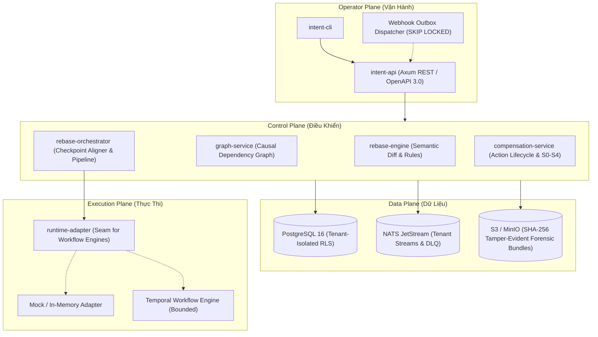
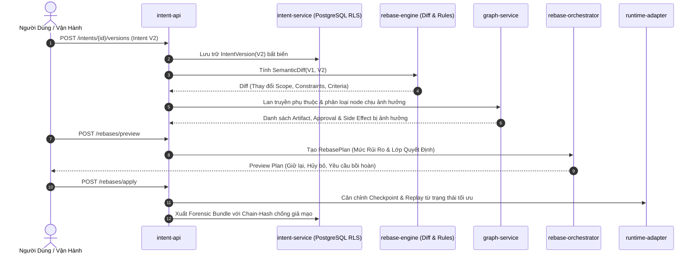

<div align="center">

# ⚡ Intent Rebase Engine (IRE)

**Rebase phần việc đang chạy khi ý định thay đổi — thay vì để agent trôi dạt trên một lời hứa đã lỗi thời.**

[](LICENSE)
[](https://www.rust-lang.org/)
[](Cargo.toml)
[](crates/)
[](docs/11-quality/01-test-strategy.md)
[](docs/02-architecture/03-trust-boundaries.md)
[](docs/README.md)
[](#ranh-giới-an-toàn--trạng-thái-production)

[Tiếng Việt](README.vi.md) · [English](README.md)

[Vấn Đề](#vấn-đề-sự-trôi-dạt-ý-định-agentic-drift) •
[Kiến Trúc](#kiến-trúc--vòng-đời-cốt-lõi) •
[Ma Trận Quyết Định](#ma-trận-quyết-định-cốt-lõi) •
[Quickstart](#quickstart) •
[API & CLI](#minh-họa-api--cli) •
[Danh Mục Crates](#danh-mục-workspace-crates-11) •
[Quality Gates](#kiểm-định--quality-gates)

---

</div>

## Vấn Đề: Sự Trôi Dạt Ý Định (Agentic Drift)

Trong các luồng làm việc tự trị nhiều bước của AI (coding copilot, tự động hóa hỗ trợ khách hàng, trợ lý nghiên cứu và DevOps agent), **ý định của con người không bao giờ cố định**. Người dùng liên tục điều chỉnh yêu cầu, siết chặt ràng buộc bảo mật, thu hồi quyền hạn nhạy cảm hoặc cắt giảm ngân sách ngay giữa chừng khi agent đang chạy.

Các kiến trúc agent hiện nay thường xử lý sự thay đổi ý định giữa chừng theo một trong hai cách gây tổn thất nặng nề:
1. **Phớt lờ sự thay đổi (Agentic Drift):** Agent tiếp tục thực thi dưới ý định cũ, đốt token LLM đắt đỏ, tạo pull request với code lỗi thời, hoặc gây ra các tác động phụ bên ngoài (side effects) không thể đảo ngược dưới một sự ủy quyền đã bị bác bỏ.
2. **Hủy toàn bộ và khởi động lại từ đầu (Wasted Progress):** Hệ thống dừng mọi thứ và chạy lại từ zero, vứt bỏ toàn bộ kết quả kiểm thử hợp lệ, các lệnh gọi công cụ tốn kém và các phê duyệt của con người vốn không hề bị ảnh hưởng bởi thay đổi mới.

```
Khi KHÔNG CÓ IRE:
Người dùng đổi Spec ───► Agent tiếp tục chạy theo prompt cũ ──► Sản phẩm sai lệch / Vô giá trị ❌
                     └── Hoặc: Hủy toàn bộ & chạy lại từ zero ─► Đốt Token & Mất sạch tiến độ ❌

Khi CÓ IRE:
Người dùng đổi Spec ───► IRE Tính Toán Semantic Diff ────────► Duyệt Đồ Thị Tác Động Nhân Quả
                                                              ├── Giữ nguyên công việc hợp lệ (Checkpoints)
                                                              ├── Hủy bỏ các phê duyệt đã lỗi thời
                                                              ├── Lên lịch bồi hoàn tự động (S1-S4)
                                                              └── Xuất Kế Hoạch Thực Thi Đã Rebase ⚡
```

**Intent Rebase Engine (IRE)** cung cấp một **control plane** chuyên biệt, định hướng kiểm toán (audit-first) cho các thay đổi ý định. IRE phiên bản hóa intent, tính toán khác biệt ngữ nghĩa (semantic diff), mô hình hóa tác động lan truyền thông qua đồ thị phụ thuộc (causal graph), và **rebase** tiến trình đang chạy, checkpoint, phê duyệt cùng các side effect bên ngoài sang intent mục tiêu mới nhất.

---

## Kiến Trúc & Vòng Đời Cốt Lõi

IRE được thiết kế theo mô hình 4-Plane phân tách rõ ràng trách nhiệm, cô lập an toàn đa tầng và bảo đảm khả năng replay tiền định (deterministic replay):



### Vòng Đời Rebase (The Rebase Lifecycle)



---

## Ma Trận Quyết Định Cốt Lõi

Để đảm bảo tính tiền định và khả năng kiểm toán minh bạch, IRE chuẩn hóa mọi khác biệt intent và side effect thành các phân lớp toán học chặt chẽ:

### 1. 5 Lớp Quyết Định (Decision Classes A–E)

| Lớp Quyết Định | Tên Gọi | Điều Kiện Kích Hoạt | Hành Động Tự Động | Phê Duyệt Con Người |
| :---: | :--- | :--- | :--- | :---: |
| **Class A** | **No-op** | Diff không ảnh hưởng ngữ nghĩa tới tác vụ đang chạy. | Tiếp tục thực thi bình thường. | Không |
| **Class B** | **Soft Review** | Metadata hoặc tiêu chí phi chức năng thay đổi. | Đánh dấu cờ cần review; bảo toàn tiến độ. | Tùy chọn |
| **Class C** | **Partial Repair** | Thêm/bớt ràng buộc cụ thể; có checkpoint phù hợp. | Hủy các node downstream; replay từ checkpoint gần nhất. | Rủi ro thấp: Không<br/>Rủi ro cao: Có |
| **Class D** | **Compensation + Repair** | Side effect ngoại vi đã xảy ra (đã mở PR, gửi email). | Chạy bồi hoàn tự động cho S1; yêu cầu duyệt cho S2–S4. | **Bắt buộc** |
| **Class E** | **Hard Restart** | Mục tiêu cốt lõi bị mâu thuẫn hoàn toàn. | Hủy toàn bộ; dọn sạch state; chạy lại workflow. | **Bắt buộc** |

### 2. 5 Cấp Độ Side-Effect ($S_0$ đến $S_4$)

Mọi side effect do agent tạo ra đều được gắn nhãn cấp độ hoàn nguyên:

- **$S_0$ (Pure Read):** Truy vấn database, tìm kiếm tài liệu. *Không cần bồi hoàn.*
- **$S_1$ (Internal Reversible):** Ghi file tạm, chỉnh sửa workspace local, commit chưa push. $\rightarrow$ **Cấp độ duy nhất được phép tự động rollback (`can_auto_execute = true`).**
- **$S_2$ (External Reversible):** Mở GitHub PR, tạo ticket Jira, tạo draft document. $\rightarrow$ Bồi hoàn qua hành động đối trọng (đóng PR kèm comment lý do). *Cần phê duyệt.*
- **$S_3$ (External Partially Reversible):** Thông báo khách hàng, gửi email, tin nhắn chat. $\rightarrow$ Bồi hoàn qua thông báo đính chính tiếp theo. *Bắt buộc manual review.*
- **$S_4$ (Irreversible):** Thanh toán tiền thật, deploy production, điều khiển phần cứng. $\rightarrow$ Tuyệt đối cấm tự động; lập tức kích hoạt chuông cảnh báo escalation.

---

## Năng Lực Nổi Bật

- 🔒 **PostgreSQL Row-Level Security (RLS):** Mọi handler ghi dữ liệu đều chạy trong transaction RLS ép buộc thiết lập `app.current_tenant_id`. Tuyệt đối không rò rỉ dữ liệu chéo giữa các tenant.
- 🛡️ **Phòng Chống Tấn Công SSRF:** Bộ dispatch webhook chủ động phân giải URL và từ chối toàn bộ IP loopback, link-local, multicast và dải IP nội bộ tư nhân (private CIDRs).
- ⛓️ **Chuỗi Kiểm Toán Chống Giả Mạo:** Các gói forensic bundle liên kết tuần tự qua hàm băm SHA-256 liên tục ([`chain_hash.rs`](crates/forensic-service/src/chain_hash.rs)), đảm bảo không ai có thể sửa đổi lịch sử replay.
- ⚡ **Chế Độ In-Memory Không Phụ Thuộc:** Cả 11 crates đều hỗ trợ chạy in-memory thuần túy. Bạn có thể test hoặc nhúng IRE vào agent Rust của mình mà không cần dựng Postgres hay NATS.
- 🔄 **Hàng Đợi Webhook Không Xung Đột Race Condition:** Outbox worker tận dụng cú pháp `FOR UPDATE SKIP LOCKED` của PostgreSQL để phân phối song song không trùng lặp.
- 🚦 **Fail-Closed Tự Kiểm Tra Khởi Động:** Hệ thống từ chối mở cổng HTTP nếu các cấu hình an toàn về DB, RLS, JWT hay worker chưa đạt chuẩn production.

---

## Quickstart

### Yêu Cầu Môi Trường

- **Rust:** `1.97.1` hoặc mới hơn (đã khóa phiên bản qua [`rust-toolchain.toml`](rust-toolchain.toml))
- **Git**
- *(Tùy chọn khi chạy integration test thật)*: **Docker** & **Docker Compose v2**
- *(Tùy chọn khi lint OpenAPI)*: **Node.js 20+**

### 1. Clone & Cấu Hình

```bash
git clone https://github.com/BrianNguyen29/intent-rebase.git
cd intent-rebase

# Sao chép cấu hình phát triển cục bộ
cp .env.example .env
```

### 2. Chạy Vòng Lặp Kiểm Định Nhanh (In-Memory, Không Cần Dịch Vụ Ngoài)

Chạy kiểm tra toàn bộ workspace chỉ trong vòng chưa đầy 60 giây:

```bash
bash scripts/verify-fast.sh
```

*Lệnh này tự động chạy `cargo fmt`, `audit-rls-dml.sh`, `cargo check`, `cargo clippy -- -D warnings`, và toàn bộ unit test suite trên cả 11 crates.*

### 3. Khởi Chạy API Server

Khởi động Axum HTTP REST server ở chế độ phát triển (dùng kho lưu trữ in-memory):

```bash
cargo run -p intent-api
```

Kiểm tra trạng thái server:

```bash
curl -s http://localhost:8080/health
# Kết quả: {"status":"ok","timestamp":"..."}
```

### 4. (Tùy Chọn) Khởi Động Trọn Bộ Dịch Vụ Local

Nếu muốn chạy thử nghiệm với PostgreSQL RLS, NATS JetStream và MinIO thật:

```bash
docker compose -f infrastructure/local/docker-compose.yml up -d
```

Chạy bộ integration test thực tế kết nối vào cụm local stack:

```bash
cargo test --workspace --all-features -- --ignored
```

---

## Minh Họa API & CLI

### Thực Hiện Rebase Trọn Vẹn Qua REST API

#### Bước 1: Tạo Intent Ban Đầu (V1)

```bash
curl -X POST http://localhost:8080/intents \
  -H "Content-Type: application/json" \
  -H "X-Tenant-Id: 00000000-0000-0000-0000-000000000001" \
  -d '{
    "workflow_id": "9b1deb4d-3b7d-4bad-9bdd-2b0d7b3dcb6d",
    "source_refs": [{"type": "issue", "id": "GH-101"}],
    "payload": {
      "objective": {"summary": "Triển khai Đăng nhập OAuth2", "success_statement": "Người dùng đăng nhập được qua GitHub"},
      "scope": {"in_scope": ["auth-service"], "out_of_scope": ["billing"]},
      "constraints": {"functional": ["hỗ trợ PKCE"], "non_functional": ["phản hồi < 200ms"], "policy": [], "budget": [], "time": []},
      "acceptance_criteria": {"required": ["Độ phủ Unit test > 80%"], "optional": []},
      "authority": {"allowed_actions": ["create_branch", "open_pr"], "forbidden_actions": ["merge_to_main"], "approval_requirements": []},
      "preferences": {"tradeoffs": []},
      "references": {"specs": [], "tickets": [], "repos": [], "policies": []},
      "assumptions": {"explicit": []},
      "metadata": {"risk_tier": "medium", "urgency": "medium", "confidence": 0.95}
    }
  }'
```

#### Bước 2: Gửi Phiên Bản Cập Nhật (V2 — bổ sung ràng buộc bắt buộc MFA)

```bash
curl -X POST http://localhost:8080/intents/{intent_id}/versions \
  -H "Content-Type: application/json" \
  -H "X-Tenant-Id: 00000000-0000-0000-0000-000000000001" \
  -d '{
    "payload": {
      "objective": {"summary": "Triển khai Đăng nhập OAuth2 kèm bắt buộc MFA", "success_statement": "Người dùng đăng nhập GitHub và xác minh TOTP"},
      "scope": {"in_scope": ["auth-service", "mfa-service"], "out_of_scope": ["billing"]},
      "constraints": {"functional": ["hỗ trợ PKCE", "bắt buộc TOTP MFA"], "non_functional": ["phản hồi < 200ms"], "policy": [], "budget": [], "time": []},
      "acceptance_criteria": {"required": ["Luồng đăng ký MFA được kiểm thử thành công"], "optional": []},
      "authority": {"allowed_actions": ["create_branch", "open_pr"], "forbidden_actions": ["merge_to_main"], "approval_requirements": ["security-lead-signoff"]},
      "preferences": {"tradeoffs": []},
      "references": {"specs": [], "tickets": [], "repos": [], "policies": []},
      "assumptions": {"explicit": []},
      "metadata": {"risk_tier": "high", "urgency": "high", "confidence": 0.90}
    }
  }'
```

#### Bước 3: Xem Trước Kế Hoạch Rebase (Preview Plan)

```bash
curl -X POST http://localhost:8080/rebases/preview \
  -H "Content-Type: application/json" \
  -H "X-Tenant-Id: 00000000-0000-0000-0000-000000000001" \
  -d '{
    "intent_id": "{intent_id}",
    "from_version": 1,
    "to_version": 2,
    "workflow_execution_ref": "wf-oauth2-run-42"
  }'
```

Phản hồi mẫu từ IRE:
```json
{
  "decision_class": "ClassC_PartialRepair",
  "risk_tier": "high",
  "invalidated_nodes": ["task_oauth_callback", "artifact_pr_draft"],
  "preserved_nodes": ["task_scaffold_routes"],
  "compensation_actions": [
    {
      "action_type": "rollback_internal_file",
      "side_effect_level": "S1_InternalReversible",
      "can_auto_execute": true
    }
  ],
  "requires_human_approval": true,
  "replay_checkpoint_id": "chk_post_scaffolding"
}
```

---

### Sử Dụng CLI Vận Hành (`intent-cli`)

Sử dụng `intent-cli` để kiểm tra quản trị và điều phối các tác vụ theo lô:

```bash
# Biên dịch công cụ CLI
cargo build -p intent-cli

# Chạy điều phối các action bồi hoàn theo danh sách ID
./target/debug/intent-cli \
  --api-url http://localhost:8080 \
  --tenant-id 00000000-0000-0000-0000-000000000001 \
  run --action-ids 3fa85f64-5717-4562-b3fc-2c963f66afa6 \
      --initiated-by "lead-sre"
```

---

## Danh Mục Workspace Crates (11)

| Crate | Plane | Thư Mục | Mô Tả Trách Nhiệm |
| :--- | :---: | :--- | :--- |
| [`intent-rebase-types`](crates/intent-rebase-types) | Domain | `crates/intent-rebase-types` | Định nghĩa domain model lõi: `IntentDocument`, `IntentVersion`, `IntentPayload`, contracts. |
| [`intent-service`](crates/intent-service) | Control | `crates/intent-service` | Lưu trữ intent, chuỗi phiên bản, checkpoint metadata và repository SQLx RLS. |
| [`rebase-engine`](crates/rebase-engine) | Control | `crates/rebase-engine` | Trọng tâm giải thuật: semantic diff, khớp luật rủi ro, phân loại lớp quyết định và sinh plan. |
| [`graph-service`](crates/graph-service) | Control | `crates/graph-service` | Đồ thị nhân quả in-memory: 12 loại node, 11 loại edge, thuật toán BFS lan truyền tác động. |
| [`rebase-orchestrator`](crates/rebase-orchestrator) | Control | `crates/rebase-orchestrator` | Điều phối rebase, căn chỉnh checkpoint và pipeline thực thi có chốt chặn kiểm duyệt. |
| [`compensation-service`](crates/compensation-service) | Control | `crates/compensation-service` | Quản lý vòng đời bồi hoàn, phân loại S0–S4 và dispatch lệnh khắc phục. |
| [`forensic-service`](crates/forensic-service) | Data | `crates/forensic-service` | Đóng gói forensic bundle, kiểm thực chuỗi SHA-256 chain-hash và xuất lên S3. |
| [`tenant-service`](crates/tenant-service) | Control | `crates/tenant-service` | Quản lý đa tenant, kiểm soát quota và cô lập bộ quy tắc riêng theo tenant. |
| [`runtime-adapter`](crates/runtime-adapter) | Execution | `crates/runtime-adapter` | Khớp nối trừu tượng cho workflow engine (bao gồm `MockAdapter` chuẩn mực và bounded Temporal). |
| [`intent-api`](crates/intent-api) | Operator | `crates/intent-api` | HTTP REST API gateway (Axum), OpenAPI 3.0, bộ lọc SSRF và Webhook Outbox worker. |
| [`intent-cli`](crates/intent-cli) | Operator | `crates/intent-cli` | CLI đồng bộ phục vụ kiểm tra, chạy thử nghiệm và thực hiện audit tác vụ. |

---

## Kiểm Định & Quality Gates

IRE áp dụng quy trình kiểm định 6 cổng nghiêm ngặt trước mỗi thay đổi mã nguồn:

| Cổng Kiểm Tra | Lệnh Thực Thi | Kết Quả | Mô Tả Chi Tiết |
| :--- | :--- | :---: | :--- |
| **1. Định dạng Rust** | `cargo fmt --all -- --check` | **PASS** | 100% tuân thủ rustfmt trên cả 11 crates. |
| **2. Bất biến RLS DML** | `bash scripts/audit-rls-dml.sh` | **PASS** | 25/25 checks vượt qua: mọi handler DML đều được bọc trong transaction RLS. |
| **3. Chuẩn OpenAPI** | `npx @stoplight/spectral-cli lint docs/04-api/openapi.yaml` | **PASS** | 0 lỗi cú pháp theo ruleset của Spectral (`.spectral.yml`). |
| **4. Biên dịch Workspace** | `cargo check --workspace --all-features` | **PASS** | 0 lỗi cú pháp hay thiếu kiểu trên toàn bộ 644 dependencies. |
| **5. Lint Tĩnh Nghiêm Ngặt** | `cargo clippy --workspace --all-features -- -D warnings` | **PASS** | 0 warning, 0 error dưới cờ cấm mọi cảnh báo. |
| **6. Toàn Bộ Test Suite** | `cargo test --workspace --lib --all-features` | **PASS** | **380+ unit tests passed, 0 lỗi, 0 cảnh báo.** |

---

## Ranh Giới An Toàn & Trạng Thái Production

> [!IMPORTANT]
> **Thông Báo Ranh Giới Vận Hành (Solo Private Production v1):**
> 
> IRE đã hoàn thành giai đoạn gia cố Phase 3 phục vụ **Solo Private Production v1** (các nhà vận hành đơn lẻ triển khai các instance riêng biệt, cô lập theo tenant).
> 
> Tuy nhiên, hệ thống **chưa được cấp chứng nhận cho môi trường Public Multi-Tenant Commercial SaaS**. Cụ thể:
> - Thông tin xác thực database của ứng dụng hiện dùng chung với tài khoản migration; việc phân tách quyền ứng dụng không đặc quyền (`P3-2`) được hoãn lại sang phiên bản vNext.
> - Adapter kết nối Temporal runtime trực tiếp đang ở mức bounded; các triển khai hiện nay sử dụng pipeline đồng bộ đã qua kiểm chứng cùng adapter mock.
> - Hệ thống chưa trải qua kiểm thử xâm nhập bên thứ ba (penetration testing) hoặc các cuộc kiểm toán độc lập theo chuẩn SOC2/ISO.

---

## Mục Lục Tài Liệu

Tài liệu chi tiết toàn diện được lưu trữ trong thư mục [`docs/`](docs/):

- 📖 **Bắt Đầu:** [Hướng dẫn Khởi Động](docs/getting-started/quickstart.md) · [Tham Chiếu Cấu Hình](docs/getting-started/configuration.md) · [Hướng Dẫn Phát Triển](docs/getting-started/development.md)
- 🏛️ **Kiến Trúc:** [Tổng Quan Hệ Thống](docs/02-architecture/01-system-overview.md) · [Danh Mục Thành Phần](docs/02-architecture/02-components.md) · [Ranh Giới Tin Cậy](docs/02-architecture/03-trust-boundaries.md)
- 📐 **Đặc Tả Kỹ Thuật:** [Mô Hình Intent](docs/03-spec/01-intent-model.md) · [Semantic Diff](docs/03-spec/02-semantic-diff.md) · [Đồ Thị Phụ Thuộc](docs/03-spec/03-dependency-graph.md) · [Rebase Engine](docs/03-spec/04-rebase-engine.md)
- 🔌 **API & Hợp Đồng:** [Đặc Tả OpenAPI](docs/04-api/openapi.yaml) · [Thiết Kế REST API](docs/04-api/01-rest-api.md) · [Sự Kiện Events](docs/04-api/02-events.md) · [Webhooks](docs/04-api/03-webhooks.md)
- 📜 **Hồ Sơ Quyết Định Kiến Trúc:** [ADR Index (15 ADRs)](docs/13-adrs/README.md)

---

## Đóng Góp, Bảo Mật & Hỗ Trợ

- **Đóng góp:** Xin vui lòng đọc [CONTRIBUTING.md](CONTRIBUTING.md) và tuân thủ văn hóa zero-overclaim. Luôn đảm bảo lệnh `bash scripts/verify-fast.sh` xanh hoàn toàn trước khi mở PR.
- **Bảo mật:** Tham khảo [SECURITY.md](SECURITY.md). Vui lòng báo cáo các lỗ hổng bảo mật hoặc rò rỉ ranh giới tenant qua kênh liên hệ riêng tư.
- **Quy tắc ứng xử:** Xem [CODE_OF_CONDUCT.md](CODE_OF_CONDUCT.md).
- **Mẫu Issue:** Sử dụng [Báo Lỗi (Bug Report)](.github/ISSUE_TEMPLATE/bug_report.md) hoặc [Yêu Cầu Tính Năng](.github/ISSUE_TEMPLATE/feature_request.md).

---

## Giấy Phép (License)

Bản quyền © Đội ngũ Intent Rebase Engine.

Được cấp phép theo **Apache License, Phiên bản 2.0** (the "License"). Bạn có thể lấy bản sao của Giấy phép tại [http://www.apache.org/licenses/LICENSE-2.0](http://www.apache.org/licenses/LICENSE-2.0).
